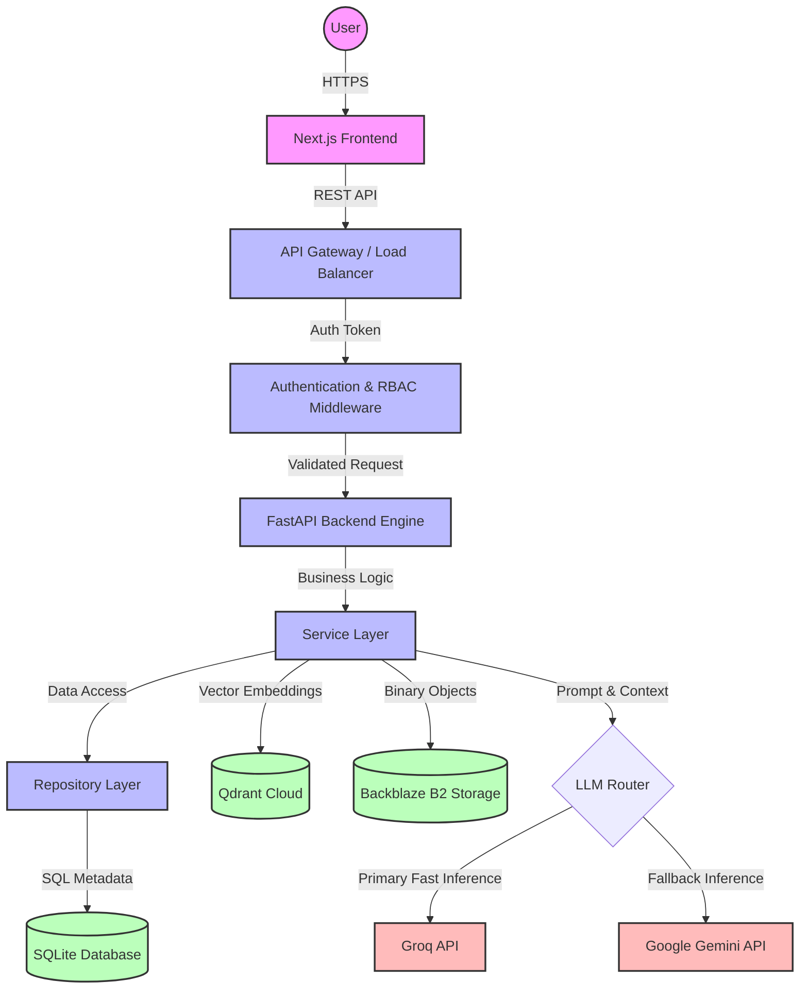
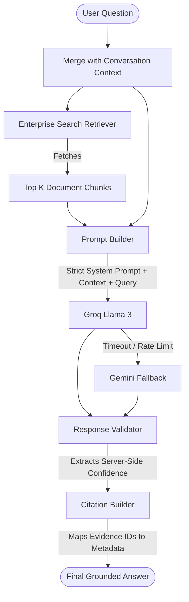
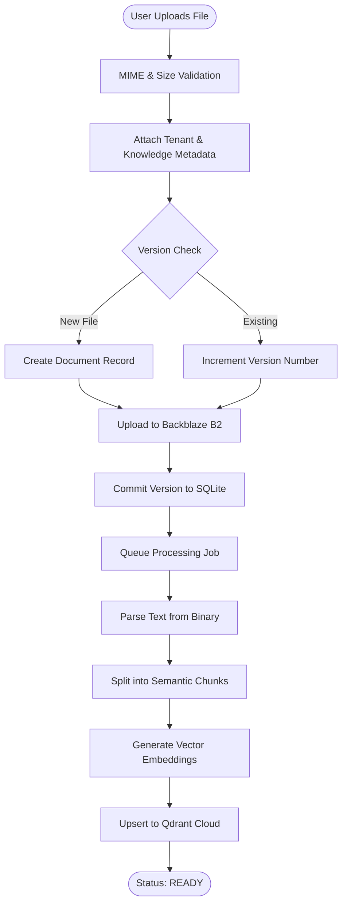
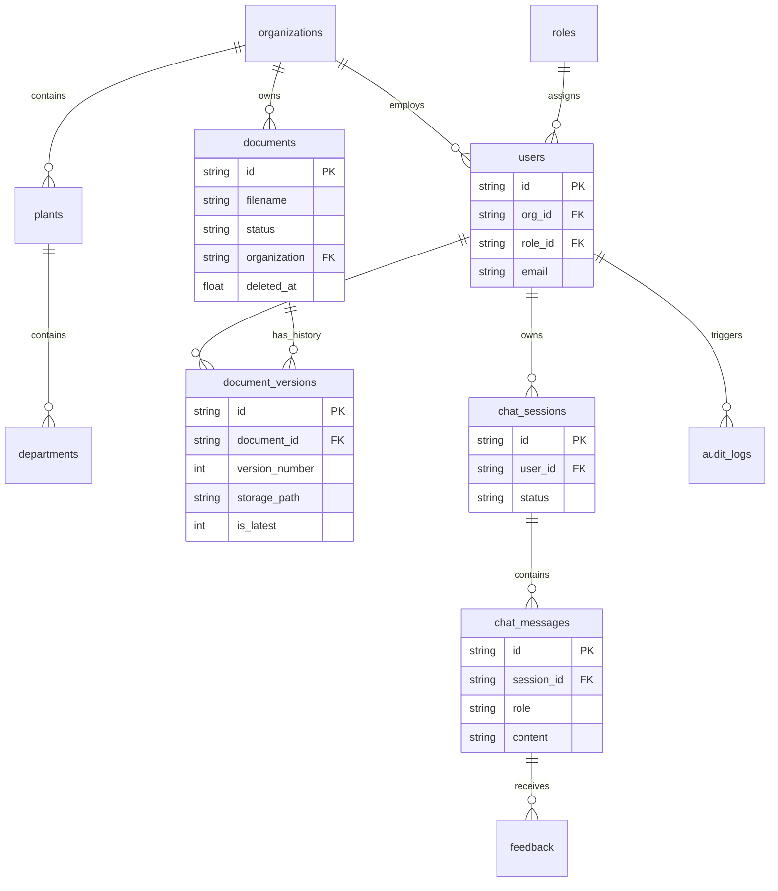

<div align="center">
  <h1>RATAN</h1>
  <p><b>R</b>etrieval-<b>A</b>ugmented <b>T</b>echnology for <b>A</b>sset <b>N</b>etworks</p>
  <p><i>An Enterprise AI Industrial Knowledge Platform</i></p>
</div>

---

## 📖 Project Description
RATAN is an enterprise-grade AI Knowledge Assistant and Document Management Platform designed specifically for industrial and manufacturing environments. It transforms raw PDF manuals, schematics, and SOPs into an interactive, highly accurate, and secure organizational Knowledge Base.

## 🎯 Problem Statement
Manufacturing plants and industrial networks generate terabytes of disconnected PDFs and manuals. Engineers spend hours searching for specific tolerances, safety protocols, and troubleshooting steps across outdated versions. Existing AI solutions hallucinate, lack access controls, and fail to cite specific engineering documentation.

## 💡 Solution
RATAN bridges this gap by providing an isolated, multi-tenant ecosystem where industrial documents are strictly versioned, parsed, embedded, and retrieved using an advanced RAG (Retrieval-Augmented Generation) pipeline. Every AI response is fully grounded in the organization's proprietary documents, providing exact citations (Document, Page, Chunk) to eliminate hallucinations.

---

## 🏗️ System Architecture

The RATAN ecosystem is designed as a modular, API-first architecture, separating the client interface from core business logic, metadata storage, vector retrieval, and AI orchestration.



### Component Breakdown
1. **Next.js Frontend**: The presentation layer utilizing TailwindCSS for dynamic, responsive UI. Handles client-side state and communicates purely via REST.
2. **FastAPI Backend**: The core engine. Handles asynchronous routing, request validation via Pydantic, and strictly enforces tenant boundaries.
3. **SQLite Metadata**: Stores relational structures: Tenants, Users, Document states, audit logs, and Chat session histories.
4. **Backblaze B2**: Immutable object storage containing the original physical PDF/Text files uploaded by users.
5. **Qdrant Cloud**: A highly scalable vector database holding embedded text chunks. Allows for semantic similarity searches filtered by tenant metadata.
6. **Groq (Primary LLM)**: Selected for ultra-low latency token generation, critical for conversational RAG flows.
7. **Gemini (Fallback LLM)**: Engaged via the Compensating Transaction Pattern if the primary provider experiences rate limits or downtime.

---

## 🧠 Enterprise Retrieval-Augmented Generation (RAG)

The RAG pipeline is the core mechanism powering the AI Knowledge Assistant. It guarantees that the AI only answers using organizational facts.



### Security & Grounding Strictures
1. **Context as Data**: The System Prompt explicitly instructs the LLM to treat the retrieved context as arbitrary data, preventing prompt injection attacks hidden inside uploaded documents.
2. **Server-Side Confidence**: The LLM is not trusted to evaluate its own confidence. Confidence is calculated server-side based on the cosine distance and reranking scores of the retrieved chunks.
3. **Deterministic Citations**: The LLM outputs inline tags (e.g., `[1]`). The Server maps these tags back to the original SQLite/Qdrant metadata, ensuring the client receives exact `[Document ID, Page Number, Section]` citations.

---

## 📄 Document Lifecycle

The Document Lifecycle governs how raw files transition from a user upload into a verifiable, embedded, and version-tracked Knowledge Base asset.



---

## 🗄️ Database Architecture

RATAN utilizes SQLite (V2 Schema) as its primary metadata store, optimized with comprehensive indexing and referential integrity (Foreign Keys) to support multi-tenant enterprise features.



---

## ✨ Key Features
- **Multi-tenant Architecture**: Strict data isolation by Organization, Plant, and Department.
- **Document Lifecycle & Versioning**: Immutable document version tracking, deduplication via SHA-256 checksums, and soft-delete retention.
- **Enterprise RAG & Search**: MMR (Maximal Marginal Relevance) based semantic search with dynamic metadata filtering.
- **Role-Based Access Control (RBAC)**: Fine-grained permissions and action-based access.
- **Operations Dashboard**: Real-time analytics on token usage, system health, storage, and processing jobs.
- **Platform Administration**: SuperAdmin portal for managing global tenants, configurations, and maintenance tasks.

---

## 🛠️ System Requirements
- Python 3.10+
- Node.js 18+
- SQLite3
- Qdrant Cloud Cluster
- Backblaze B2 Bucket

## 🚀 Installation & Running Locally

1. **Clone the repository:**
   ```bash
   git clone https://github.com/your-org/ratan.git
   cd ratan
   ```

2. **Backend Setup:**
   ```bash
   cd backend
   python -m venv .venv
   source .venv/bin/activate
   pip install -r requirements.txt
   ```

3. **Environment Variables (`backend/.env`):**
   ```env
   JWT_SECRET_KEY=your_secure_secret
   B2_KEY_ID=your_backblaze_key_id
   B2_APPLICATION_KEY=your_backblaze_app_key
   B2_BUCKET_NAME=your_bucket_name
   QDRANT_URL=your_qdrant_url
   QDRANT_API_KEY=your_qdrant_api_key
   GROQ_API_KEY=your_groq_api_key
   GOOGLE_API_KEY=your_gemini_api_key
   ```

4. **Run the Backend:**
   ```bash
   uvicorn app.main:app --reload --port 8000
   ```

## 🗺️ Roadmap
- [x] Foundation & Multi-tenancy
- [x] Document Lifecycle Engine
- [x] Knowledge Base Creation
- [x] Enterprise Search & RAG
- [x] AI Knowledge Assistant
- [x] Dashboard & Analytics
- [x] Platform Administration
- [ ] Predictive Maintenance Workflows
- [ ] Live IoT Integration

## 📄 License
MIT License. See `LICENSE` for details.
