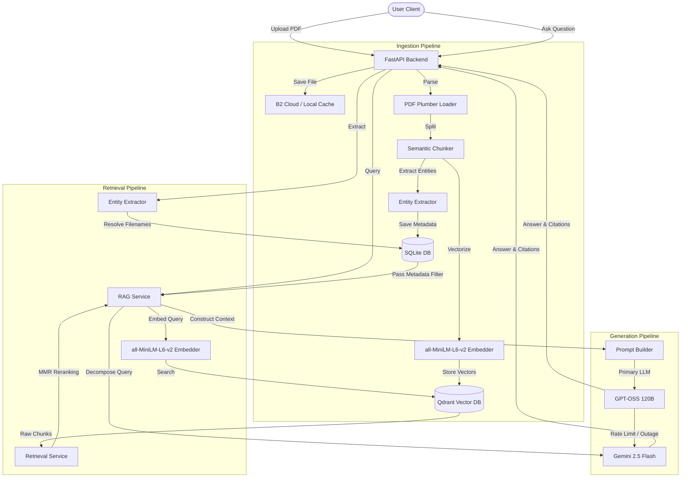
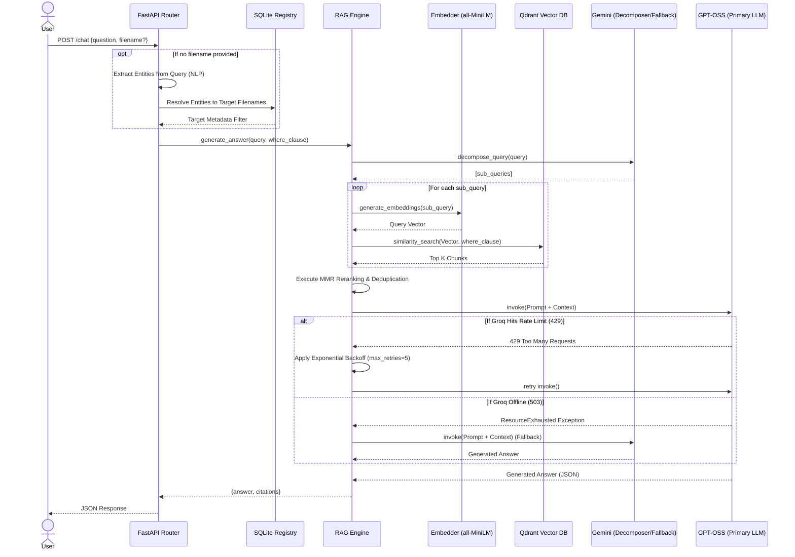

# RATAN: Industrial Knowledge Intelligence Platform

   

## 📖 Project Overview
**RATAN** (Retrieval-Augmented Technical Analytics Network) is an enterprise-grade Industrial Knowledge Intelligence Platform. 

### Problem Statement
Manufacturing and industrial enterprises possess vast repositories of technical manuals, annual reports, troubleshooting guides, and SOPs. This data is often stored in legacy formats, highly dense structures, and locked within complex, multi-column PDFs. Accessing precise technical information quickly during critical operational downtime is a significant bottleneck.

### Motivation
To bridge the gap between static industrial documentation and dynamic, intelligent retrieval. Engineers and operators need a highly optimized semantic search system that can read a dense technical manual and answer complex troubleshooting queries instantly.

### Objectives
- Create a highly accurate Retrieval-Augmented Generation (RAG) system.
- Support legacy industrial PDFs, including complex tables and financial reports.
- Enable lightning-fast English semantic search with high-precision contextual retrieval.
- Guarantee hallucination resistance by strictly enforcing document-grounded citations.

### Features
- **Semantic Chunking:** Context-aware slicing of dense industrial PDFs using `sentence-transformers/all-MiniLM-L6-v2`.
- **Hybrid Search Engine:** `Qdrant` vector database combined with entity-based metadata filtering.
- **Resilient Generation:** Primary generation via `GPT-OSS 120B` with intelligent auto-failover to `Gemini 2.5 Flash`.
- **Advanced Table Extraction:** Preserves spatial and relational contexts of deep financial tables.
- **English-Optimized Retrieval:** Extremely fast semantic search optimized for English documentation.
- **Transparent Citations:** Every generated fact is traced back to the exact chunk, page, and document.

---

## 🏗 Architecture Diagram



### Sequence Flow: Chat Pipeline



---

## 📂 Folder Structure

```text
.
├── backend/
│   ├── app/                    # Core Application Logic
│   │   ├── api/                # FastAPI Routers (Endpoints)
│   │   ├── database/           # SQLite Connections
│   │   ├── entity/             # NLP Entity Extraction Rules
│   │   ├── models/             # Pydantic Schemas
│   │   ├── rag/                # RAG Core (Chunking, Embedding, LLM)
│   │   ├── services/           # Orchestration & Cleanup Services
│   │   └── storage/            # File Management Interfaces
│   ├── storage/uploads/        # Local PDF storage volume
│   ├── .env                    # Environment variables
│   ├── requirements.txt        # Python dependencies
│   └── main.py                 # FastAPI Application Entrypoint
```

### Responsibilities
* **`app/api/`**: Exposes HTTP endpoints. Sanitizes inputs and formats outputs.
* **`app/rag/`**: The brain of the system. Handles semantic chunking, embedding generation, MMR reranking, and LLM communication.
* **`app/services/`**: Binds the API layer to the internal RAG and Storage layers. Manages lifecycle events (e.g., document uploading, cleanup).
* **`app/storage/`**: Abstracts the file system. Currently hard-locked to Local Storage for production stability.

---

## 🛠 Technology Stack

| Component | Technology | Purpose |
|-----------|------------|---------|
| **Backend Framework** | `FastAPI` | High-performance asynchronous API server. |
| **Embeddings** | `all-MiniLM-L6-v2` | Fast, lightweight English embedding model (384 dims). |
| **Vector DB** | `Qdrant` | High-speed cloud vector similarity search. |
| **Primary LLM** | `openai/gpt-oss-120b` (via Groq) | Fast, highly accurate reasoning and generation. |
| **Fallback LLM** | `gemini-2.5-flash` (via Google) | Redundant generation pipeline for disaster recovery. |
| **Relational DB** | `SQLite` | Tracks document metadata and processing statuses. |
| **File Parsing** | `pdfplumber` | Precise spatial PDF extraction (tables and text). |

---

## 🔌 API Documentation

### 1. Upload Document
* **Route:** `/documents/upload`
* **Method:** `POST`
* **Description:** Uploads a PDF file, chunks it, vectorizes the text, and stores it in Qdrant.
* **Request Body:** `multipart/form-data` containing the `file`.
* **Response:**
  ```json
  {
    "document_id": "uuid-string",
    "filename": "manual.pdf",
    "status": "Ready",
    "message": "Document processed successfully"
  }
  ```

### 2. Chat Query
* **Route:** `/chat`
* **Method:** `POST`
* **Description:** Queries the RAG system to generate an answer based on the ingested documents.
* **Request Body:**
  ```json
  {
    "question": "What is the operating temperature?",
    "filename": "manual.pdf"
  }
  ```
  *(Note: `filename` is optional. If omitted, it defaults to a global semantic search across all indexed PDFs).*
* **Response:**
  ```json
  {
    "answer": "The operating temperature is 45C.",
    "citations": [
      {
        "text": "...operating temperature is 45C...",
        "source": "manual.pdf",
        "page_no": 12
      }
    ],
    "entities": []
  }
  ```

### 3. Cleanup System
* **Route:** `/cleanup`
* **Method:** `POST`
* **Description:** Forces a backend synchronization. Purges failed documents, cleans up dangling vector indexes, and resolves stale SQLite states.
* **Response:** `{"status": "success", "message": "Cleanup completed."}`

---

## 🌊 Pipeline Data Flows

### 📥 Upload Pipeline
1. **Receive:** FastAPI accepts the PDF bytes.
2. **Save:** `LocalStorage` saves the PDF to disk.
3. **Parse:** `DocumentLoader` extracts text and spatial data using `pdfplumber`.
4. **Chunk:** `Chunker` divides text into semantically complete, overlapping chunks (preserving markdown tables).
5. **Embed:** `EmbeddingService` converts chunks to 384-dimension vectors via `sentence-transformers/all-MiniLM-L6-v2`.
6. **Store:** `Qdrant` stores vectors and associated metadata (Source, Page, Chunk ID).

### 🤖 Chat Pipeline
1. **Decompose:** Complex user questions are broken down into simpler sub-queries.
2. **Retrieve:** Each sub-query fetches the Top K chunks from Qdrant via Cosine Similarity.
3. **Rerank:** Maximal Marginal Relevance (MMR) removes duplicate context and maximizes diversity.
4. **Prompt Construction:** Chunks are injected into a strict system prompt demanding JSON outputs and explicit citations.
5. **Generation:** Groq LLM streams the answer. If Groq hits a `429`, the system auto-retries. If Groq fails entirely, the system auto-routes to Gemini.

---

## 🛡 Storage Architecture

* **Cloud Storage (`Backblaze B2`):** Acts as the primary cold-storage volume for raw PDFs. Ensures high durability and accessibility across distributed nodes.
* **Local Cache (`backend/storage/uploads/`):** Acts as a temporary ephemeral cache for file processing before uploading to B2.
* **Vector Storage (`Qdrant`):** Manages the dense vector embeddings and metadata indexing.
* **SQLite (`ratan_registry.db`):** Maintains the source of truth for UI client status polling (`Processing`, `Ready`, `Failed`).

### Error Handling Protocols
| Error Scenario | System Response |
|----------------|-----------------|
| **Invalid/Corrupt PDF** | Caught during `pdfplumber` initialization. Fails gracefully. Status marked as `Failed`. |
| **Legacy Fonts (Kruti Dev)** | Embeddings process raw CID characters. LLM safely reports: *"The provided document does not specify this."* (Requires future OCR integration). |
| **Groq Rate Limit (429)** | Native exponential backoff triggers. Thread sleeps and retries seamlessly up to 5 times. |
| **Groq Outage (500/503)** | Exception caught. Traffic routed to Fallback `Gemini` client. |
| **Missing API Keys** | Fast-fails on startup via strict `os.environ` validation in dependencies. |

### 🧠 Production Memory Management
The platform is aggressively optimized to run on tiny instances (like Render's 512MB RAM free tier).
* **Lazy Dependency Injection:** Heavy Machine Learning libraries (like PyTorch and `sentence-transformers`) are deliberately removed from global and constructor imports. They are strictly lazy-loaded on the first `/chat` or `/documents/upload` request. This allows the Uvicorn ASGI server to bind to its port in milliseconds without OOM-crashing during health checks.
* **Thread Capping:** PyTorch is dynamically hard-capped to `torch.set_num_threads(1)` and OpenMP/MKL thread counts are restricted to 1 via environment variables. This prevents PyTorch from allocating massive thread pools on low-core cloud instances, entirely preventing `502 Bad Gateway` Out-Of-Memory crashes.

---

## ⚙️ Environment Variables

| Variable | Purpose | Required | Example |
|----------|---------|----------|---------|
| `GROQ_API_KEY` | Primary LLM Authentication | Yes | `gsk_abc123...` |
| `GOOGLE_API_KEY` | Fallback LLM Auth | Yes | `AIzaSy_...` |
| `QDRANT_URL` | Vector DB Cluster Endpoint | Yes | `https://xyz.qdrant.io` |
| `QDRANT_API_KEY` | Vector DB Auth Token | Yes | `eyJhbG...` |
| `STORAGE_PROVIDER` | Toggle storage ('local' or 'b2') | No (Defaults to local) | `b2` |
| `B2_KEY_ID` | Backblaze B2 Key ID | Yes (if b2) | `005f4c4d...` |
| `B2_APPLICATION_KEY` | Backblaze B2 App Key | Yes (if b2) | `K005E64e...` |
| `B2_BUCKET_NAME` | Backblaze B2 Bucket Name | Yes (if b2) | `RATANAI` |
| `HF_TOKEN` | Hugging Face Hub Authentication Token | Recommended | `hf_...` |
| `HF_HUB_OFFLINE` | Force offline mode for embeddings | No | `1` |

> [!TIP]
> **Hugging Face Rate Limits:** If you get a `500 Internal Server Error` stating that `sentence-transformers/all-MiniLM-L6-v2` is not a local folder when uploading a document, you are being rate-limited by Hugging Face's anonymous API. To fix this, either provide an `HF_TOKEN` (from a free Hugging Face account) OR run the app once successfully and then set `HF_HUB_OFFLINE=1` in your `.env` to read the model directly from your local cache!

---

## 🚀 Installation Guide

### Local Development Setup

1. **Clone the Repository**
   ```bash
   git clone <repo-url>
   cd "Ei ai hackton"/backend
   ```

2. **Create a Virtual Environment**
   ```bash
   python3 -m venv .venv
   source .venv/bin/activate
   ```

3. **Install Dependencies**
   ```bash
   pip install -r requirements.txt
   ```

4. **Configure Environment**
   Edit the `.env` file and insert your valid API keys (Groq, Google, Qdrant).

5. **Run the Backend**
   ```bash
   uvicorn app.main:app --reload --host 0.0.0.1 --port 8000
   ```
   *The Swagger UI will be available at http://127.0.0.1:8000/docs*

---

## 🔮 Future Improvements & Limitations
1. **OCR Preprocessing:** Legacy scanned PDFs (encoded with non-standard fonts) cannot currently be parsed by `pdfplumber`. Integration with `Tesseract` or `Surya-OCR` is required for total legacy ingestion capability.
2. **Frontend Integration:** The backend architecture is fully production-hardened. The next phase is mapping the provided API contracts to a React/Next.js frontend.
3. **Session Memory:** Implementing a conversational buffer (e.g., `Redis` chat history) to allow multi-turn reasoning without requiring massive context window injections.

---
*Generated by the Principal AI Architect Team.*
