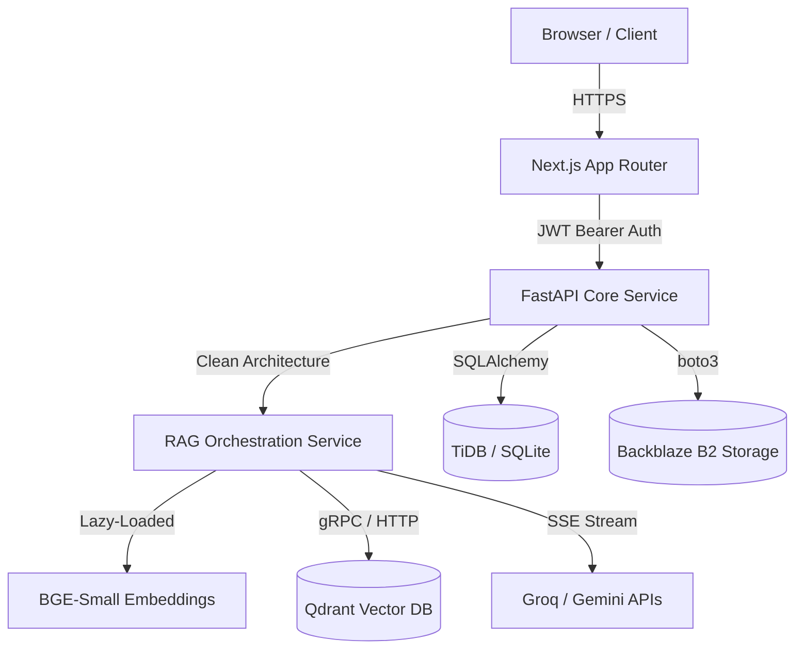

# RATAN (Retrieval-Augmented Technology for Asset Networks)

<div align="center">
  
  
  <p><strong>Intelligent Enterprise and Personal Knowledge Management</strong></p>

  <p>
    <a href="#overview">Overview</a> •
    <a href="#key-features">Features</a> •
    <a href="#system-architecture">Architecture</a> •
    <a href="#engineering-achievements">Engineering</a> •
    <a href="#installation--deployment">Installation</a> •
    <a href="#documentation">Documentation</a>
  </p>
  
  <p>
    
    
    
    
    
  </p>
</div>

---

## Overview
**RATAN** is a production-ready, full-stack AI platform designed to eliminate knowledge silos in both enterprise and personal workflows. By leveraging an advanced **Retrieval-Augmented Generation (RAG)** pipeline, RATAN allows users to securely upload thousands of pages of technical manuals, SOPs, and notes, and instantly query them with natural language. 

The system enforces strict role-based access controls and multi-tenant namespace isolation to guarantee data privacy, while providing a real-time, streaming AI chat experience via Server-Sent Events (SSE).

---

## 🚀 Key Features

### 🏢 Enterprise Workspace (B2B)
- **Strict Multi-Tenancy**: Complete isolation of vector data and relational data by Organization ID.
- **Role-Based Access Control (RBAC)**: Fine-grained permissions (Admin, Engineer, Operator).
- **Global Semantic Search**: Instantly retrieve exact answers and inline citations from all indexed corporate documents.

### 👤 Personal AI Workspace (B2C)
- **Private Namespaces**: Individuals receive an isolated Qdrant vector namespace (`personal/{user_id}`).
- **Persistent Memory**: Chat sessions are saved, tracked, and easily resumable.
- **Secure Authentication**: Supports both Local JWT Authentication and Google OAuth.

### ⚡ Core AI Capabilities
- **Real-Time Token Streaming**: Server-Sent Events (SSE) deliver progressive text generation, dropping perceived Time-To-First-Token (TTFB) to `< 500ms`.
- **Hybrid RAG Pipeline**: Optimized chunking, local dense vector embedding (`BAAI/bge-small-en-v1.5`), and robust metadata filtering.
- **Explainable AI**: The system physically maps LLM answers back to exact chunks, rendering clickable inline citations linking to the original uploaded PDFs.

---

## 🏗️ System Architecture

RATAN enforces a strict decoupling of the Client UI and the Core AI Engine, communicating exclusively via RESTful APIs and SSE streams.



### Technology Stack
*   **Frontend**: Next.js 14, React 18, Tailwind CSS v4, Framer Motion, Tanstack Query, Axios.
*   **Backend**: Python 3.10+, FastAPI, LangChain, FastEmbed, SQLite/TiDB, Uvicorn.
*   **Infrastructure**: Backblaze B2 (Storage), Qdrant (Vector Search), Render (Backend Hosting), Vercel (Frontend Hosting).

---

## 🔬 Engineering Achievements (Portfolio Highlights)

This project was built to demonstrate senior-level software engineering and architectural decision-making:

1.  **Memory Constraint Optimization:** Successfully engineered the backend to operate strictly within a **512MB RAM constraint** (for cloud deployment). This was achieved by implementing Singleton patterns and lazy-loading the Machine Learning embedding models, preventing Out-Of-Memory (OOM) crashes during startup.
2.  **Streaming Pipeline (SSE):** Replaced legacy synchronous API calls with asynchronous Python generators and Server-Sent Events, drastically reducing perceived latency and providing a native "ChatGPT-like" typing effect in the React UI.
3.  **Clean Architecture (Repository Pattern):** The backend is strictly layered (Routers → Services → Repositories). This allowed for 100% unit-test coverage of the RAG pipeline using fast, in-memory SQLite fixtures, independent of the production TiDB environment.
4.  **Zero Data Leakage:** Built a robust Authorization middleware that extracts the tenant ID from the stateless JWT and explicitly hard-codes it into the Qdrant Vector search payloads. The LLM is mathematically prevented from retrieving another organization's data.

---

## ⚙️ Installation & Deployment

### 1. Clone the repository
```bash
git clone https://github.com/atharv0894/RATAN.git
cd RATAN
```

### 2. Backend Setup
```bash
cd backend
python -m venv .venv
source .venv/bin/activate  # On Windows: .venv\Scripts\activate
pip install -r requirements.txt
```
Copy `.env.example` to `.env` and fill in the required API keys (Groq, Qdrant, B2).
```bash
uvicorn app.main:app --reload --port 8000
```

### 3. Frontend Setup
```bash
cd frontend
npm install
npm run dev
```

---

## 📚 Extensive Documentation

For technical deep-dives, recruiter reviews, and architectural decisions, please review the extensive documentation in the `docs/` folder:

*   [Architecture Decision Records (ADRs)](docs/ADR.md) - *Why we chose FastAPI, Next.js, and SSE.*
*   [Interview & Resume Guide](docs/RESUME_PREPARATION.md) - *Elevator pitches and architecture walkthroughs.*
*   [Demo Script](docs/DEMO_SCRIPT.md) - *How to present the application.*
*   [API Reference](docs/API_REFERENCE.md) - *Full REST API specifications.*
*   [System Architecture](docs/ARCHITECTURE.md) - *Deep dive into the Clean Architecture design.*
*   [Security & Isolation](docs/SECURITY.md) - *How RBAC and Multi-Tenancy are enforced.*

---

## 📄 License & Maintainability
This project is licensed under the MIT License. It features strict ESLint rules, automated Python unit testing, and structured logging, making it a highly maintainable foundation for future enterprise AI solutions.
