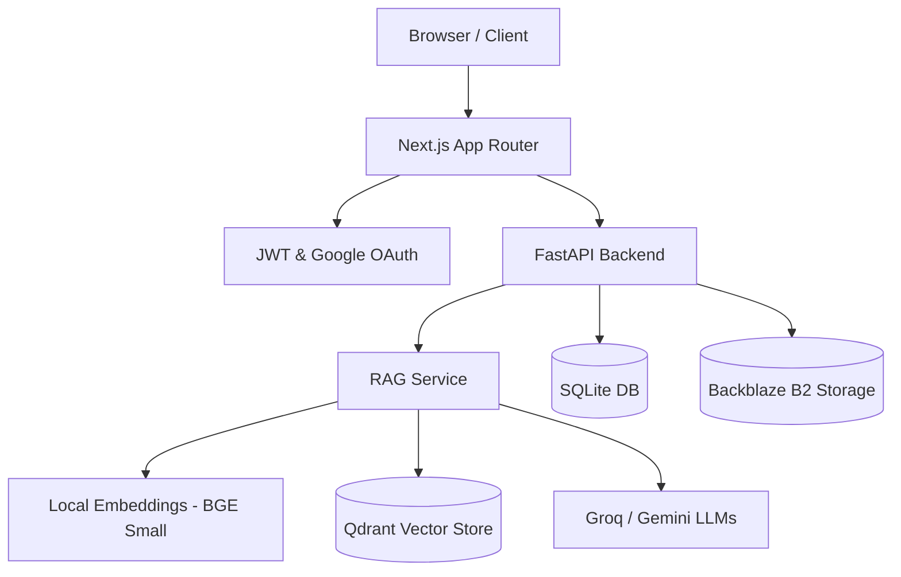

# RATAN (Retrieval-Augmented Technology for Asset Networks)

<div align="center">
  
  
  <p><strong>Intelligent Enterprise and Personal Knowledge Management</strong></p>

  <p>
    <a href="#features">Features</a> •
    <a href="#architecture">Architecture</a> •
    <a href="#tech-stack">Tech Stack</a> •
    <a href="#installation">Installation</a> •
    <a href="#deployment">Deployment</a>
  </p>
</div>

## Overview
RATAN is a comprehensive knowledge intelligence platform that seamlessly handles both **Enterprise** and **Personal** AI workflows. It combines advanced Retrieval-Augmented Generation (RAG) with role-based access control, allowing organizations to maintain strict data boundaries while offering a fully private workspace for individual users.

---

## 🚀 Features

### 🏢 Enterprise Workspace
- **Multi-Tenant Architecture**: Strict separation of data by Organization, Plant, and Department.
- **Role-Based Access Control (RBAC)**: Fine-grained permissions (Admin, Engineer, Operator).
- **Industrial RAG**: Optimized for technical manuals, SOPs, CAD notes, and safety guidelines.
- **Auditing & Telemetry**: Full lifecycle tracking of documents and API requests.

### 👤 Personal AI Workspace
- **Namespace Isolation**: Users get their own private vector namespace (`personal/{user_id}`).
- **Chat & Memory**: Persistent, private chat sessions that learn from your interactions.
- **Personal Knowledge Base**: Upload PDFs, notes, and code snippets exclusively for your AI to contextually answer.
- **Secure Authentication**: Google OAuth and Local JWT auth for personal accounts.

### 🛠️ Core Technical Capabilities
- **Advanced RAG Engine**: Hybrid search, metadata filtering, chunk reranking, and query expansion.
- **Streaming Responses**: Real-time LLM interaction (simulated for JSON validation, rendered instantly).
- **Dual AI Fallback**: Groq (Llama 3 / GPT-OSS) as primary, Gemini 2.5 Flash as fallback.
- **Glassmorphism UI**: Beautiful, fully responsive, hardware-accelerated Next.js frontend.

---

## 🏗️ Architecture

RATAN is broken into a decoupled frontend and backend. 



For detailed architecture breakdowns, view the [Documentation](#documentation).

---

## 💻 Tech Stack

**Frontend**
- Next.js 14 (App Router)
- React 18
- Tailwind CSS v4 & Framer Motion (Animations)
- React Query (Tanstack) for API state caching
- Lucide React (Icons)

**Backend**
- Python 3.10+
- FastAPI & Uvicorn
- LangChain, FastEmbed (BAAI/bge-small-en-v1.5)
- Qdrant (Vector Database)
- SQLite (Relational Database)

**Infrastructure**
- Vercel (Frontend Deployment)
- Render (Backend Deployment)
- Backblaze B2 (S3-compatible Document Storage)

---

## 📂 Folder Structure

The repository is structured into two completely independent services:

```text
RATAN/
├── frontend/                 # Next.js Application
│   ├── app/                  # App Router Pages
│   │   ├── dashboard/        # Enterprise Workspace
│   │   ├── personal/         # Personal AI Workspace
│   │   └── super-admin/      # System Management
│   ├── components/           # Reusable UI elements
│   ├── lib/                  # Utilities and API clients (Axios)
│   └── public/               # Static assets
├── backend/                  # FastAPI Application
│   ├── app/
│   │   ├── api/              # API Route Handlers
│   │   ├── database/         # SQLite schema and connections
│   │   ├── rag/              # The entire RAG pipeline (Retrieval, Prompting, LLMs)
│   │   └── services/         # Business logic
│   └── main.py               # Application entrypoint
└── docs/                     # Extensive system documentation
```

---

## ⚙️ Installation & Running Locally

### 1. Clone the repository
```bash
git clone https://github.com/atharv0894/RATAN.git
cd RATAN
```

### 2. Backend Setup
```bash
cd backend
python -m venv .venv
source .venv/bin/activate  # On Windows: .venv\Scripts\activate
pip install -r requirements.txt
```
Create a `.env` file in the `backend` directory (see [Environment Variables](#environment-variables)).
```bash
uvicorn app.main:app --reload --port 8000
```

### 3. Frontend Setup
```bash
cd frontend
npm install
```
Create a `.env.local` file in the `frontend` directory.
```bash
npm run dev
```

---

## 🌍 Environment Variables

See `docs/DEPLOYMENT.md` for a full list of required environment variables for both local and production environments. Essential keys include:
- `JWT_SECRET_KEY`
- `QDRANT_URL` and `QDRANT_API_KEY`
- `GROQ_API_KEY` and `GOOGLE_API_KEY`
- `B2_APPLICATION_KEY_ID`

---

## 📚 Documentation

We maintain extensive documentation for every part of the system in the `docs/` folder:

1. [System Architecture](docs/ARCHITECTURE.md)
2. [Frontend Architecture](docs/FRONTEND.md)
3. [Backend Architecture](docs/BACKEND.md)
4. [RAG Pipeline](docs/RAG_PIPELINE.md)
5. [Database Schema & ER Diagram](docs/DATABASE_SCHEMA.md)
6. [API Reference](docs/API_REFERENCE.md)
7. [Security & Isolation](docs/SECURITY.md)
8. [Deployment Guide](docs/DEPLOYMENT.md)

---

## 🔒 Security
- **Authentication**: JWT-based auth with HTTP-only potential and Bearer tokens.
- **Tenant Isolation**: RAG searches explicitly filter by `organization_id` or `namespace` (`personal/{user_id}`).
- **CORS**: Strict Origin validation on the API layer.

---

## 📄 License
This project is licensed under the MIT License.

## 🤝 Contributors
Built for Enterprise Intelligence and Personal Productivity.
