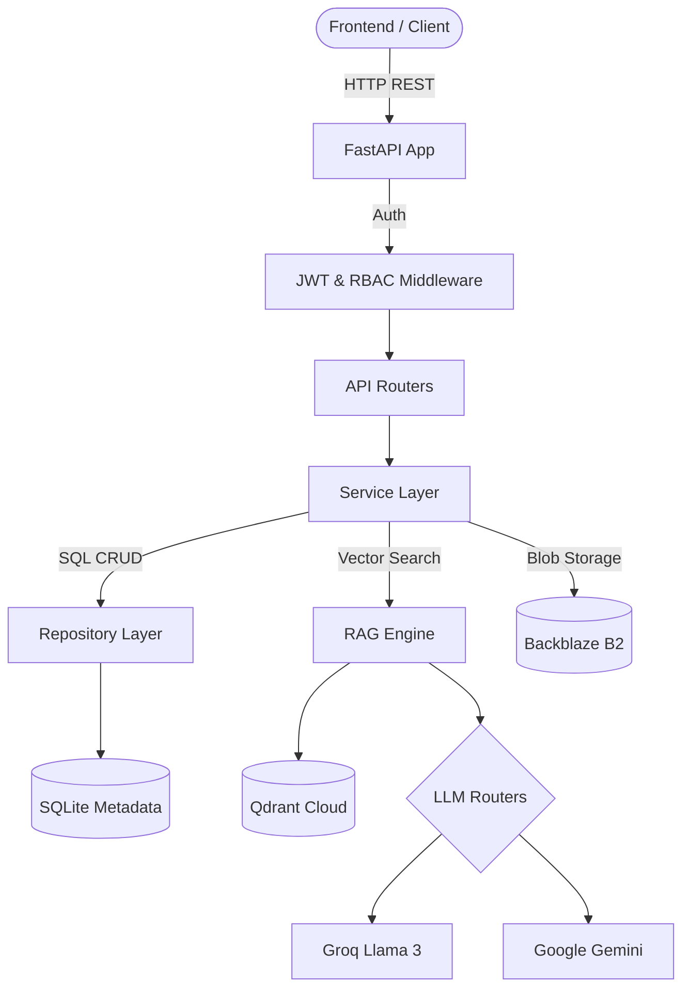

# RATAN Backend

This is the Python (FastAPI) backend for the **RATAN** (Retrieval-Augmented Technology for Asset Networks) platform.

## 🏗️ High-Level Architecture



## 🧠 Core Technologies
- **Framework**: FastAPI (Python 3.10+)
- **Database**: SQLite (V2 Enterprise Schema)
- **Vector Store**: Qdrant Cloud
- **Object Storage**: Backblaze B2
- **AI Models**: Groq (Primary), Gemini (Fallback)

## 📁 Project Structure
- `app/api/`: Presentation layer containing all REST API endpoints.
- `app/services/`: Domain-driven business logic and orchestration.
- `app/database/`: SQLite connection pooling, migrations, and the Repository layer.
- `app/rag/`: Advanced Retrieval-Augmented Generation pipeline (chunking, parsing, searching, prompting).
- `app/storage/`: B2 cloud integration and local mock storage.
- `app/entity/`: NLP extraction for dynamic metadata tagging.
- `tests/`: Pytest suite for end-to-end and unit testing.

## ✨ Enterprise Features
1. **Multi-tenancy**: Strict isolation between Organizations, Plants, and Departments.
2. **Immutable Document Lifecycle**: Complete history tracking and deduplication using SHA-256.
3. **Server-Side AI Grounding**: LLMs are restricted by strict system prompts, and confidence is scored server-side using vector proximity.
4. **Operations Dashboard**: Real-time analytical aggregations executed cleanly at the database level.
5. **Admin Portal**: Global cross-tenant controls for maintenance and system settings.

## 🚀 Quick Start
```bash
python -m venv .venv
source .venv/bin/activate
pip install -r requirements.txt
uvicorn app.main:app --reload --port 8000
```
