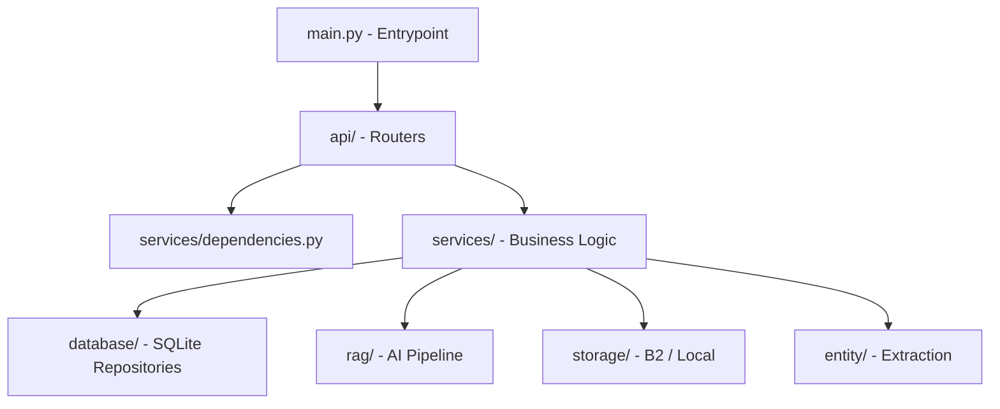

# RATAN Backend Core (`app/`)

This is the main Python package for the RATAN backend, built atop FastAPI.

## 🏗️ Internal Structure

## 🧠 Core Modules
- **`api/`**: Contains all FastAPI route definitions grouped by domain (auth, documents, chat, admin).
- **`database/`**: Manages the SQLite connection pool, schema creation, migrations, and the Repository layer.
- **`services/`**: The decoupled business logic layer bridging HTTP requests to database transactions and AI processes.
- **`rag/`**: The Retrieval-Augmented Generation engine. Handles document parsing, chunking, semantic search, and LLM prompting.
- **`storage/`**: Manages blob storage, interfacing with Backblaze B2 or the local filesystem.
- **`entity/`**: Natural Language Processing utilities to extract hard metadata (Plant IDs, Equipment Names) from unstructured text.
- **`models/`**: Global Pydantic validation schemas.

## ✨ Application Initialization (`main.py`)
The `main.py` file acts as the bootloader. It:
1. Loads environment variables.
2. Initializes the database and runs necessary migrations.
3. Sets up CORS middleware.
4. Registers all API routers under the `/api/v1` prefix.
