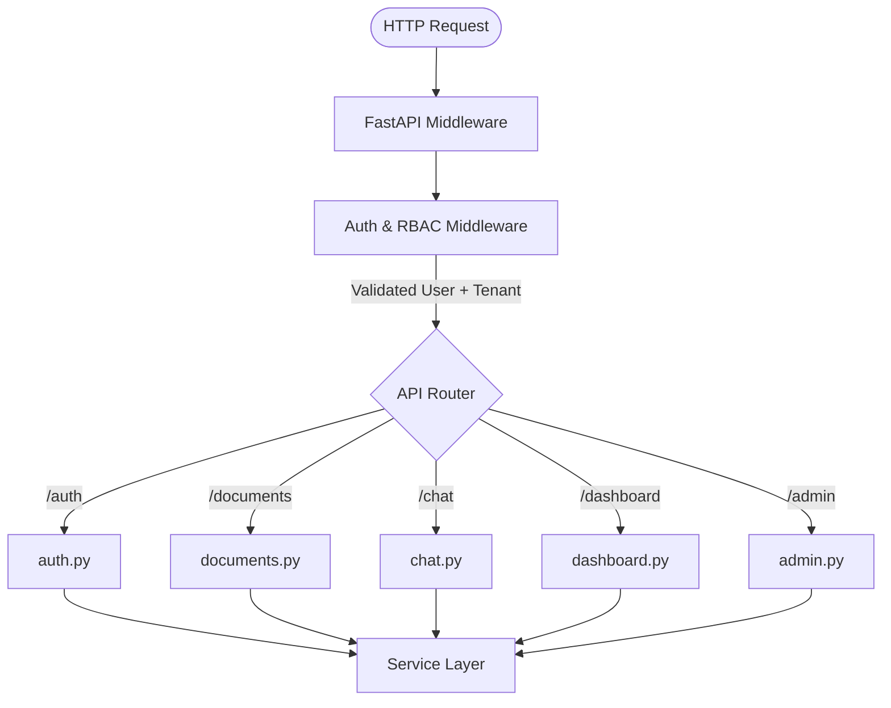

# Presentation Layer (`app/api/`)

This directory contains all FastAPI routers. It acts as the HTTP entry point for external clients, bridging network requests to internal business logic.

## 🏗️ Routing Architecture

## 🧠 Core Tasks
- **Pydantic Validation**: Ensures all incoming JSON bodies (`POST`/`PATCH`) match strict schema definitions.
- **Dependency Injection**: Resolves `get_current_user`, `RequireRole`, and database connections before a route function executes.
- **Serialization**: Translates Service layer output (often dictionaries or lists) back into standardized JSON `APISuccessResponse` objects.

## ✨ Features
- **Tenant Isolation**: Injects `organization_id` strictly from JWTs.
- **Role-Based Access**: Defines exactly which endpoints require `User`, `Admin`, or `SuperAdmin` privileges.
- **Stateless Routing**: Retains no state, allowing for infinite horizontal scaling of API nodes.
