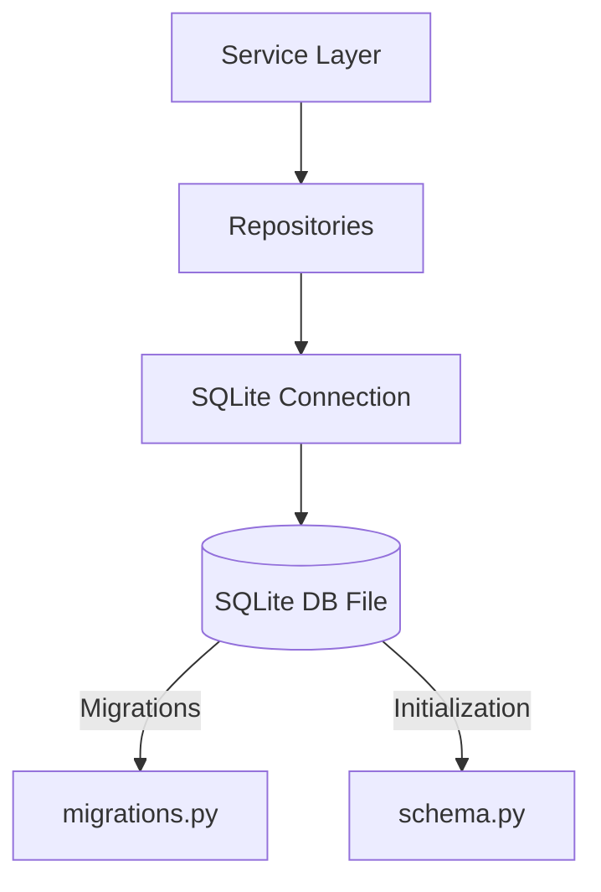

# Database Layer (`app/database/`)

This module manages the local SQLite database which serves as the **Single Source of Truth** for the RATAN platform's relational metadata. 

> **Note**: Document text chunks and vectors are NEVER stored here. They belong in Qdrant.

## 🏗️ Architecture

## 🧠 Core Components
- `schema.py`: Defines the V2 Enterprise normalized database schema, encompassing `users`, `roles`, `organizations`, `documents`, `document_versions`, and `audit_logs`.
- `sqlite.py`: Handles connection pooling, thread-local connections (`check_same_thread=False`), and SQLite-specific pragmas like WAL mode for performance.
- `repositories.py`: Implements the Repository Pattern, abstracting raw SQL queries away from the Service layer.

## 🛠️ Migrations
Migrations are handled declaratively via `migrations.py` to seamlessly upgrade V1 schemas to the current V2 Enterprise architecture without data loss.

## ✨ Features
- **ACID Compliance**: Ensuring relational integrity via strict Foreign Keys across Organizations, Plants, and Users.
- **Soft Deletion**: Uses `is_deleted` and `deleted_at` flags to maintain historical references instead of dropping rows.
