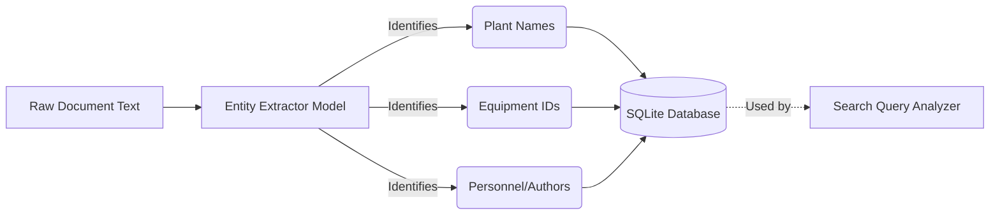

# Entity Extraction (`app/entity/`)

This module leverages Natural Language Processing (NLP) to dynamically extract explicit entities from uploaded documents.

## 🏗️ Extraction Pipeline

## 🧠 Core Features
- Extracts domain-specific entities (e.g., Plant Names, Equipment IDs, Personnel, Dates).
- `entity_extractor.py`: Parses text and maintains extraction mapping in the SQLite metadata DB.
- These entities are later utilized by the RAG `SearchEngine`'s `QueryAnalyzer` to automatically map conversational inputs to hard SQL/Qdrant filters.

## ✨ Advanced Search Binding
When a user asks "What is the procedure for Valve XYZ at Plant A?", the search engine uses this entity mapping to restrict the Qdrant vector search strictly to documents tagged with `Equipment=Valve XYZ` and `Location=Plant A`, rather than relying solely on semantic vector proximity.
