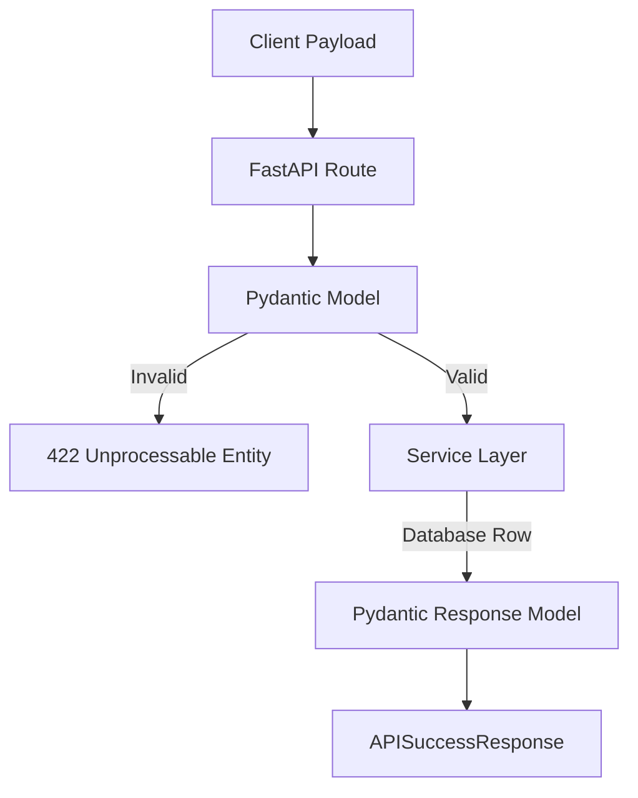

# Models Layer (`app/models/`)

This directory houses the foundational Pydantic data schemas used across the application to ensure strict type validation and structural integrity.

## 🏗️ Validation Architecture

*Note: With the V2 architecture update, many route-specific Pydantic models (like `ChatRequest`, `UserRegisterRequest`, and `APISuccessResponse`) have been co-located within their respective `app/api/` modules for tighter cohesion. This directory now primarily stores global application types.*

## ✨ Features
- **Type Coercion**: Automatically converts JSON strings to Python `UUID` or `datetime` objects.
- **OpenAPI Schema**: Pydantic models automatically generate the Swagger UI documentation for the frontend developers.
