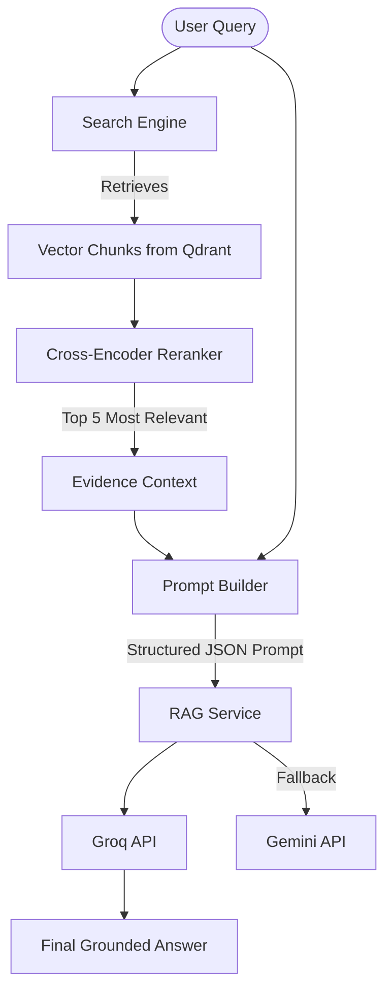

# Enterprise RAG Engine (`app/rag/`)

This is the AI core of the RATAN platform. It orchestrates the entire Retrieval-Augmented Generation pipeline.

## 🏗️ RAG Pipeline Architecture

## 🧠 Sub-Modules & Tasks
- `parsers/`: Modular `ParserFactory` supporting PDF (PyMuPDF), DOCX (python-docx), CSV, MD, and TXT extraction.
- `search/`: The **SearchEngine** (Strategy Pattern) which dynamically executes `SimilaritySearch`, `MMRSearch`, `MetadataSearch`, or `HybridSearch` based on query intent.
- `chunker.py`: Page-aware semantic chunking logic.
- `indexer.py`: Manages deduplication (SHA-256) and insertion into Qdrant.
- `prompt_builder.py`: Constructs strict, JSON-enforced payloads for LLM grounding and citation linking.
- `rag_service.py`: The orchestrator tying search and generative modeling (Groq/Gemini) together.

## ✨ Features
- **Server-Side Confidence**: Calculates answer reliability based on vector similarity distance.
- **Exact Citations**: Emits inline tags mapped to exact document versions.
- **Failover Mechanisms**: Employs Compensating Transactions to failover to Gemini if Groq rate-limits.
