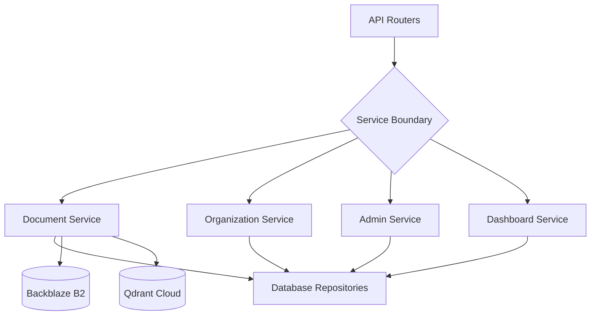

# Business Logic Layer (`app/services/`)

This module houses the core orchestration of the RATAN application. It sits perfectly between the `api` (Presentation) and `database` (Persistence) layers.

## 🏗️ Service Architecture

## 🧠 Core Tasks
- **Business Rule Enforcement**: Checking uniqueness (e.g. duplicate filenames, emails) before database insertion.
- **Workflow Orchestration**: E.g., `DocumentService.upload_document` must upload binary to Backblaze, create a `document_versions` record, queue an embedding job, and write an Audit Log.
- **Exception Handling**: Catching database constraint errors and throwing HTTP-ready domain exceptions (like `NotFoundError` or `DuplicateResourceError`).

## ✨ Features
- **Decoupled**: Services are pure Python classes/functions. They do not know about HTTP requests or FastAPI dependencies.
- **Transaction Management**: Groups related DB operations and handles `commit()` vs `rollback()`.
- **Cross-Tenant Admin Logic**: Centralizes complex global aggregations via the `AdminService` and `DashboardService`.
