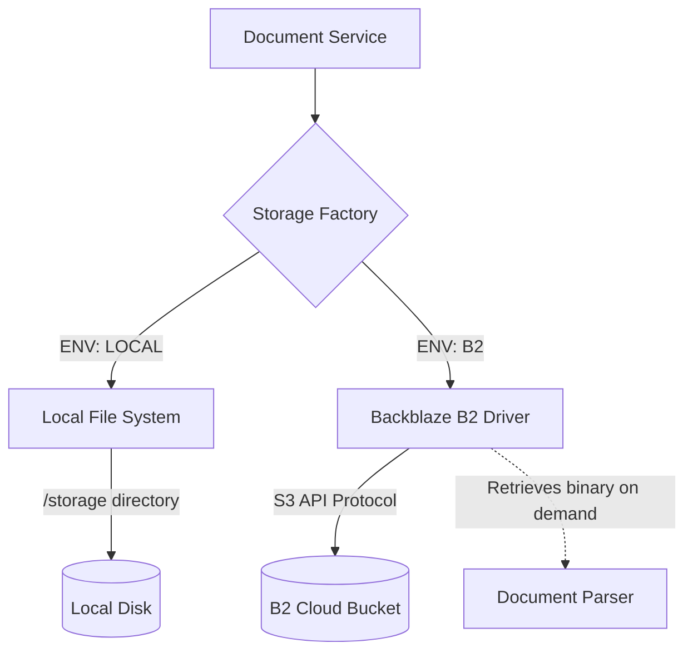

# Storage Layer (`app/storage/`)

This module manages the physical storage of user-uploaded files, totally decoupled from the vector search and metadata database.

## 🏗️ Storage Architecture

## 🧠 Components
- `storage_service.py`: A unified Factory interface that routes upload/download commands based on the configured environment.
- `local_storage.py`: For local testing/hackathon mode. Saves raw documents to a local `/storage` directory.
- `b2_storage.py`: Enterprise cloud driver leveraging Backblaze B2 (S3-compatible API). Ideal for infinite scaling and persistent high-availability document storage.

## ✨ Features
- **Immutability**: Files are written once per version. Updates create new physical objects.
- **Deduplication**: Files are hashed (SHA-256) before upload. If the exact byte sequence exists, the upload is skipped, and the metadata points to the existing blob.
