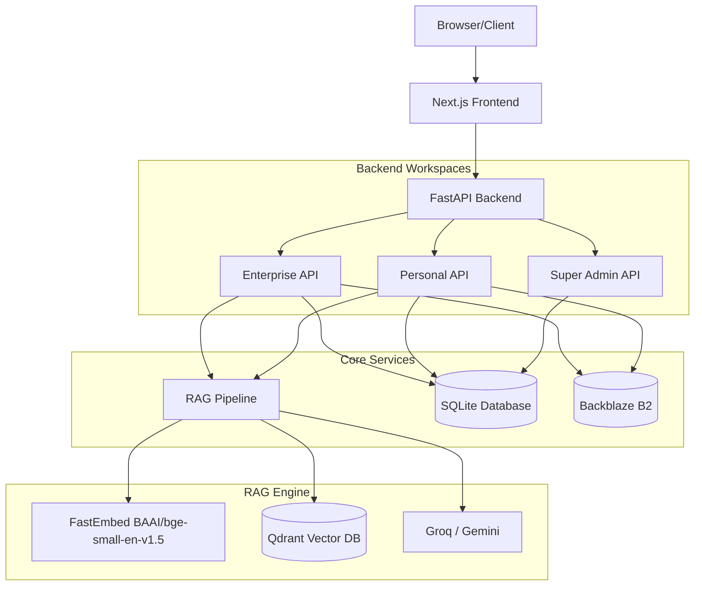

# System Architecture

RATAN is designed as a scalable, multi-tenant Intelligence Platform composed of three distinct workspaces: **Enterprise**, **Personal**, and **Super Admin**.

## High-Level Architecture Diagram

## Workspaces

### 1. Enterprise Workspace
Designed for multi-tenant B2B environments. 
- **Tenancy**: Data is strictly isolated by `organization_id`, `plant_id`, and `department_id`.
- **Role-Based Access Control (RBAC)**: Users are assigned specific roles (e.g., Admin, Engineer) which define their permissions.
- **Document Management**: Complex document lifecycle including status tracking (QUEUED, PROCESSING, READY) and versioning.

### 2. Personal AI Workspace
Designed for individual consumers or isolated environments.
- **Tenancy**: Data is isolated by a personal `namespace` (`personal/{user_id}`).
- **Features**: Chat, memory, private file uploads.
- **Simplicity**: No plant/department complexity. Just a user and their data.

### 3. Super Admin Workspace
Designed for system operators to monitor the platform.
- **Capabilities**: Monitor all organizations, view API telemetry, manage global settings, configure AI fallback providers.

## Component Interactions

1. **Client -> API**: The Next.js frontend sends requests to the FastAPI backend using standard HTTP/REST. 
2. **API -> DB**: FastAPI uses standard `sqlite3` driver to query the relational database for users, roles, chat history, and metadata.
3. **API -> RAG**: When a chat message is sent, the API invokes the `RAGService`.
4. **RAG -> Qdrant**: The RAG service converts the query to embeddings locally and searches Qdrant, applying strict metadata filters (`namespace` or `organization_id`) to ensure data isolation.
5. **RAG -> LLM**: The RAG service constructs a prompt with the retrieved context and calls Groq (or Gemini as a fallback) to generate the final response.
