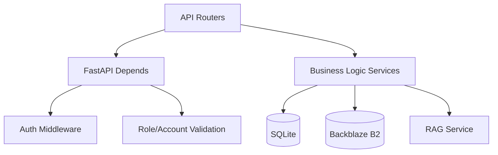

# Backend Architecture

The backend is built with **FastAPI**. It follows a strictly decoupled, service-oriented architecture.

## Architecture Diagram



## Folder Structure
```text
backend/app/
├── api/             # HTTP endpoints and routing
├── database/        # Database connection and schema definitions
├── exceptions/      # Custom error handling
├── rag/             # Retrieval-Augmented Generation engine
└── services/        # Business logic and dependencies
```

## API Layer
Endpoints are separated logically by workspace and domain:
- `/api/v1/enterprise/*`: Enterprise specific routes.
- `/api/v1/personal/*`: Personal AI specific routes.
- `/api/v1/super-admin/*`: Admin routes.
- `/api/v1/auth/*`: Authentication.

## Middleware & Interceptors
1. **CORSMiddleware**: Registered at the outermost layer to intercept all OPTIONS requests securely.
2. **Audit Logging**: An HTTP middleware that measures request latency, logs the request path, status code, and IP, and injects `X-Process-Time` into the response headers.

## Authentication & Authorization
The backend uses JSON Web Tokens (JWT) for stateless authentication.

**Dependency Injection:**
FastAPI's `Depends` is heavily utilized to enforce security boundaries at the route level:
- `RequirePersonalUser`: Validates the user has a `PERSONAL` account.
- `RequireOrganizationUser`: Validates the user has an `ORGANIZATION` account.
- `RequireSuperAdmin`: Validates the user has a `SUPER_ADMIN` account.
- `RequireRole(["Admin"])`: Enforces specific enterprise roles.

## Error Handling
Custom exceptions (`AppException`, `ValidationError`, `AuthenticationError`) are caught by a global exception handler in `main.py`. This ensures all API errors return a standard JSON structure:
```json
{
  "success": false,
  "error": {
    "code": "ERROR_CODE",
    "message": "Human readable message"
  }
}
```
