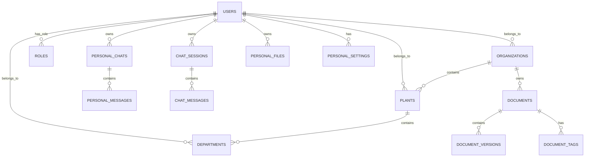

# Database Schema

RATAN uses a relational database (SQLite/PostgreSQL) for user management, metadata, audit logging, and chat histories.

## Entity Relationship Diagram

## Key Tables

### `users`
Core identity table supporting both Personal and Enterprise users.
- `id` (PK, UUID)
- `account_type` (Enum: `PERSONAL`, `ORGANIZATION`, `SUPER_ADMIN`)
- `org_id` (FK -> organizations)
- `email`, `password_hash`
- `provider` (Enum: `LOCAL`, `GOOGLE`)
- `role_id` (FK -> roles)

### `organizations`, `plants`, `departments`
The hierarchy for Enterprise multi-tenancy.
- Allows restricting data queries dynamically.
- `plants` belong to `organizations`.
- `departments` belong to `plants`.

### `documents` & `document_versions`
Tracks all uploaded files for Enterprise RAG.
- `document_versions` tracks `checksum`, `storage_path`, `is_latest`, and vector indexing status (`status`: `READY`, `PROCESSING`).

### `personal_chats` & `personal_messages`
Stores the chat history for Personal AI users.
- `personal_chats`: `id`, `user_id`, `title`, `llm_model`
- `personal_messages`: `id`, `session_id`, `role` (user/assistant), `content`, `citations`.

### `chat_sessions` & `chat_messages`
Stores the chat history for Enterprise AI users.
- Same structure as personal tables but heavily audited.

### `processing_jobs`
Asynchronous job tracking for document embedding and indexing pipelines.
- `target_id`, `status`, `retry_count`, `error_message`.

### `user_sessions`
Tracks active JWT refresh tokens. Allows remote invalidation of devices.
