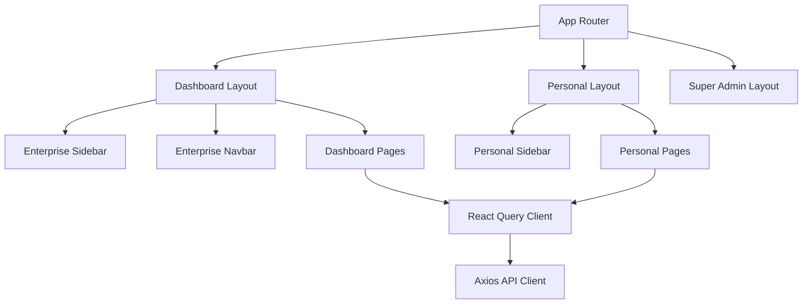

# Frontend Architecture

The frontend is built with **Next.js 14** using the App Router. It is designed to be highly responsive, modern, and modular.

## Architecture Diagram



## Tech Stack
- **Framework**: Next.js (App Router)
- **Styling**: Tailwind CSS v4
- **State Management & Data Fetching**: `@tanstack/react-query`
- **Animations**: Framer Motion
- **Icons**: Lucide React
- **Markdown Rendering**: `react-markdown`

## Folder Structure
```text
frontend/
├── app/
│   ├── dashboard/       # Enterprise pages
│   ├── personal/        # Personal AI pages
│   ├── super-admin/     # Super Admin pages
│   ├── globals.css      # Tailwind design system tokens
│   └── layout.tsx       # Root layout
├── components/          # Reusable UI components
├── lib/
│   ├── api.ts           # Centralized Axios API definitions
│   ├── auth-context.tsx # Authentication provider
│   └── utils.ts         # Helper functions
```

## Design System & Theming
The application uses a CSS-variable based theme system defined in `app/globals.css`. It supports both Light and Dark modes.

**Key Concepts:**
- **Glassmorphism**: Achieved using `bg-surface/50 backdrop-blur-xl`.
- **CSS Variables**: Colors are defined as raw hex/rgb and passed to Tailwind variables (e.g., `--background`, `--primary`).
- **Cards**: Predefined utility classes like `.card-premium` provide consistent styling across the application.

## Authentication Flow
1. User logs in via local credentials or Google OAuth.
2. The backend issues a JWT.
3. The JWT is stored in an HTTP-Only cookie (or `localStorage` depending on configuration).
4. `auth-context.tsx` checks the authentication state on mount.
5. Axios interceptors automatically attach the `Authorization: Bearer <token>` header to all requests.
