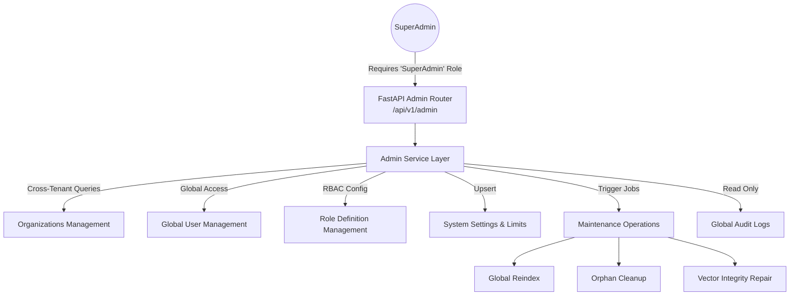

# Platform Administration Architecture

The Platform Administration module separates internal tenant management from global, cross-tenant operational management.

## Administration Flow

## Core Responsibilities
- **Global Control**: Standard routes (`/api/v1/users`) are strictly bound to the caller's tenant. The `/api/v1/admin` routes bypass tenant restrictions, explicitly requiring the highest level of authorization.
- **Dynamic Configuration**: System settings (limits, configurations, API fallbacks) are managed here and persisted to the DB, preventing the need for environment variable restarts.
- **Maintenance**: Triggers asynchronous repair and cleanup jobs to ensure storage (B2) and vectors (Qdrant) remain perfectly synchronized with relational metadata (SQLite).
