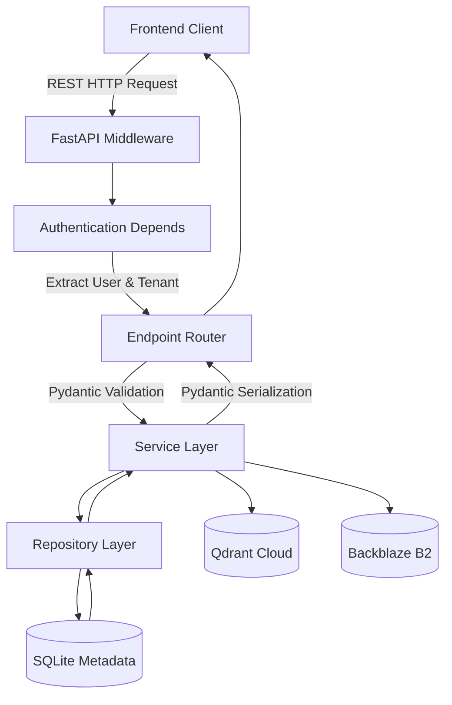

# API Architecture

RATAN leverages FastAPI to provide a lightning-fast, auto-documented (Swagger/OpenAPI) REST interface.

## Request Pipeline

## API Structure

- `/api/v1/auth/*`: Authentication, token refresh, and login.
- `/api/v1/users/*`, `/api/v1/organizations/*`: Tenant-scoped user and structure management.
- `/api/v1/documents/*`: Document uploading, metadata patching, and lifecycle operations.
- `/api/v1/chat/*`: AI Knowledge Assistant conversational endpoints.
- `/api/v1/dashboard/*`: Operational analytics and aggregations.
- `/api/v1/admin/*`: Global SuperAdmin endpoints for cross-tenant maintenance.
