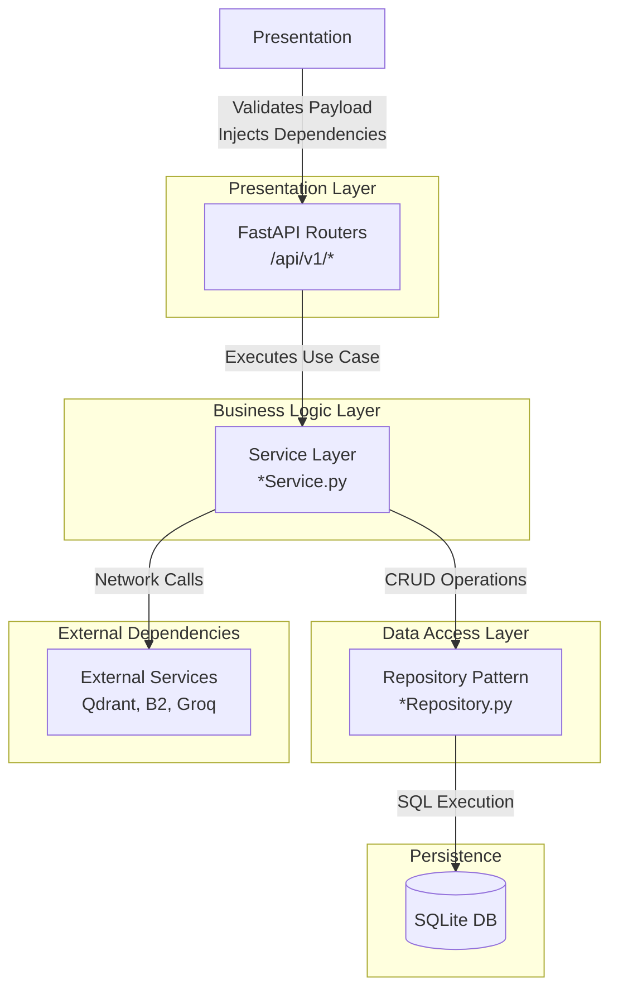

# Backend Architecture

The backend of RATAN strictly adheres to a Layered Architecture model heavily influenced by Domain-Driven Design (DDD). This ensures that routing, business logic, and database access are strictly separated, allowing for high testability and maintainability.

## Layered Flow Diagram

## Layer Descriptions

### 1. Presentation (FastAPI Routers)
- **Role**: Entry point for external HTTP requests.
- **Responsibilities**:
  - URL routing and HTTP method mapping.
  - Pydantic schema validation (Request/Response models).
  - Dependency Injection (Auth, Tenant Context).
  - Translating Python Exceptions into standard HTTP error codes (`404 Not Found`, `403 Forbidden`).

### 2. Services (Business Logic)
- **Role**: The brain of the application.
- **Responsibilities**:
  - Executing core business rules (e.g., checking if a document name is unique before creating a new version).
  - Orchestrating multiple repositories (e.g., uploading to Backblaze, saving metadata to SQLite, sending a job to the embedding queue).
  - Emitting audit logs.
  
### 3. Repositories (Data Access)
- **Role**: Data persistence abstraction.
- **Responsibilities**:
  - Translating Service Layer requests into exact SQL queries.
  - Managing database connections/cursors.
  - Hiding the underlying database technology from the Business Logic layer.

### 4. External Services
- **Role**: Out-of-network operations.
- **Responsibilities**:
  - Sending/retrieving files from Backblaze B2.
  - Searching vectors in Qdrant.
  - Prompting Groq/Gemini APIs.
