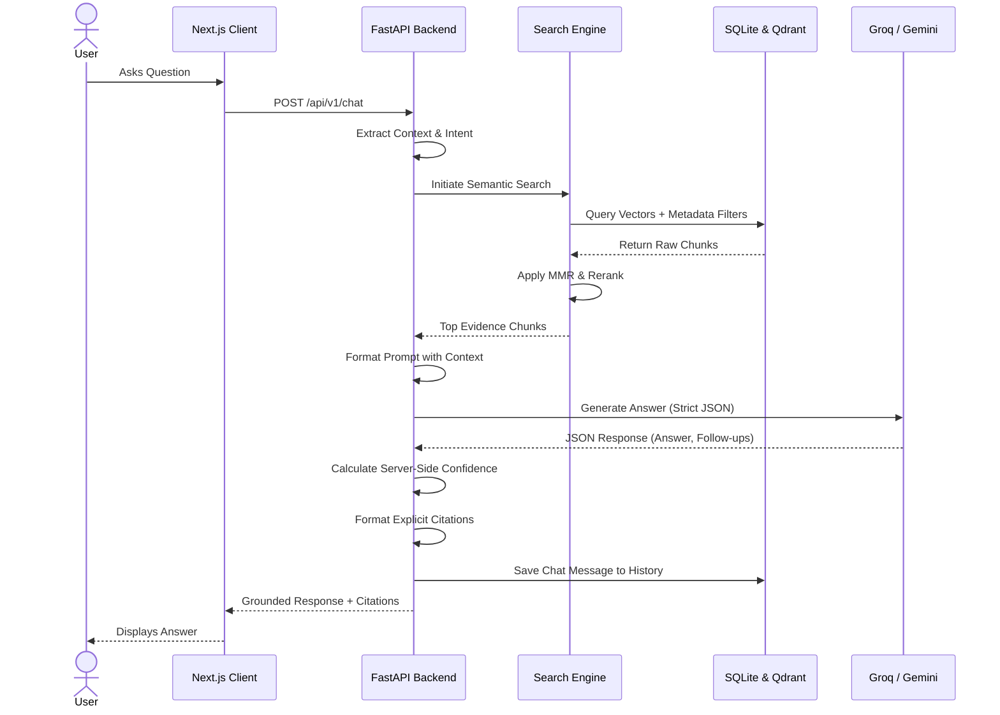

# AI Chat Flow

This sequence diagram illustrates the lifecycle of a user asking a question to the AI Knowledge Assistant.

## Interaction Sequence

```mermaid
sequenceDiagram
    actor User
    participant Frontend as Next.js Client
    participant API as FastAPI Backend
    participant Retriever as Search Engine
    participant DB as SQLite & Qdrant
    participant LLM as Groq / Gemini
    
    User->>Frontend: Asks Question
    Frontend->>API: POST /api/v1/chat
    
    API->>API: Extract Context & Intent
    
    API->>Retriever: Initiate Semantic Search
    Retriever->>DB: Query Vectors + Metadata Filters
    DB-->>Retriever: Return Raw Chunks
    
    Retriever->>Retriever: Apply MMR & Rerank
    Retriever-->>API: Top Evidence Chunks
    
    API->>API: Format Prompt with Context
    
    API->>LLM: Generate Answer (Strict JSON)
    LLM-->>API: JSON Response (Answer, Follow-ups)
    
    API->>API: Calculate Server-Side Confidence
    API->>API: Format Explicit Citations
    
    API->>DB: Save Chat Message to History
    
    API-->>Frontend: Grounded Response + Citations
    Frontend-->>User: Displays Answer
```
