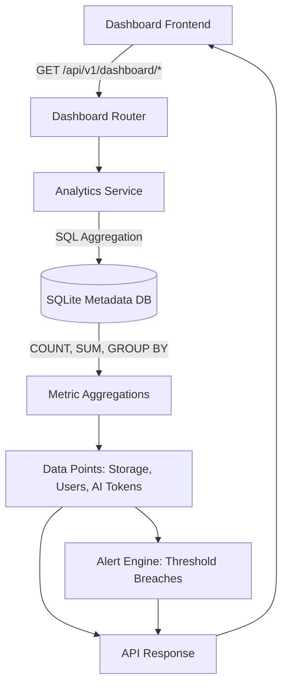

# Analytics & Dashboard Architecture

The Operations Dashboard provides real-time visibility into the health and utilization of the tenant's knowledge base and AI interactions.

## Data Flow

## Optimization Strategy
Instead of loading ORM models into Python memory and counting them, the `DashboardService` pushes all aggregation logic (`SUM`, `COUNT`, `AVG`) down into the SQLite query execution planner. This ensures that analytical queries execute in milliseconds, even across thousands of records, minimizing the impact on transactional workloads.
