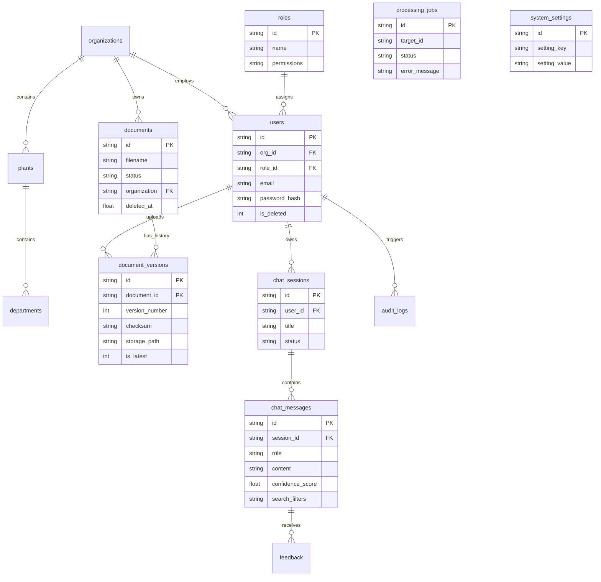

# Database Architecture

RATAN utilizes SQLite (V2 Schema) as its primary metadata store, optimized with comprehensive indexing and referential integrity (Foreign Keys) to support multi-tenant enterprise features.

## Entity Relationship Diagram

## Design Principles
- **Soft Deletion**: Entities like `users`, `organizations`, and `documents` are never immediately dropped. They utilize `is_deleted = 1` or `deleted_at = timestamp` to maintain audit compliance and historical referential integrity.
- **Tenant Isolation**: Almost every major table has a direct or indirect path to `organization_id`, ensuring simple, bulletproof row-level security checks in the Service Layer.
