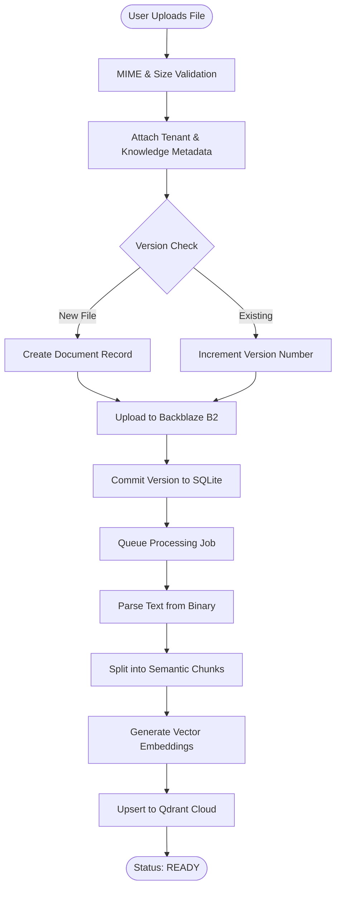
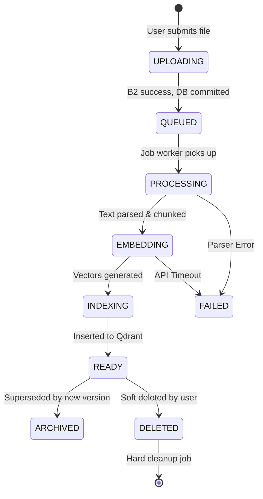

# Document Lifecycle

The Document Lifecycle governs how raw files transition from a user upload into a verifiable, embedded, and version-tracked Knowledge Base asset.

## Lifecycle Diagram

## Document States

## Immutable Versioning
Documents are never modified in place. When a user updates a document, a new `document_versions` record is created. The old version is marked `is_latest = 0` (Archived state), and the new version becomes `is_latest = 1`. This preserves historical context for old chat sessions that may have cited the older version.
