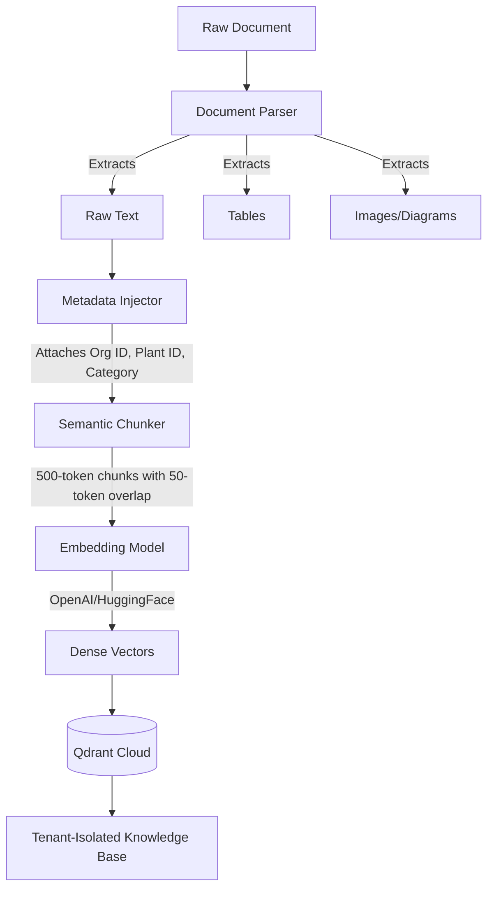

# Knowledge Base

The Knowledge Base is the aggregated semantic representation of an organization's industrial documents. It transforms static PDFs into a dynamic, queryable vector space.

## Creation Pipeline

## Pipeline Stages

1. **Parser**: Extracts pure text from binary formats. Capable of handling dense industrial PDFs, maintaining sequential logic.
2. **Metadata Injector**: Crucial for Tenant Isolation. Every single chunk of text is permanently tagged with `organization_id`, `plant_id`, `document_id`, and `version_number`.
3. **Semantic Chunker**: Splits the text into overlapping segments (e.g., 500 tokens). Overlap ensures that context spanning across the artificial boundary of a chunk is not lost.
4. **Embedding**: Translates the textual chunk into a high-dimensional mathematical vector (embeddings) that captures its semantic meaning.
5. **Qdrant**: Stores the vector alongside the injected payload metadata. This enables hybrid searching (semantic similarity + strict metadata filtering).
