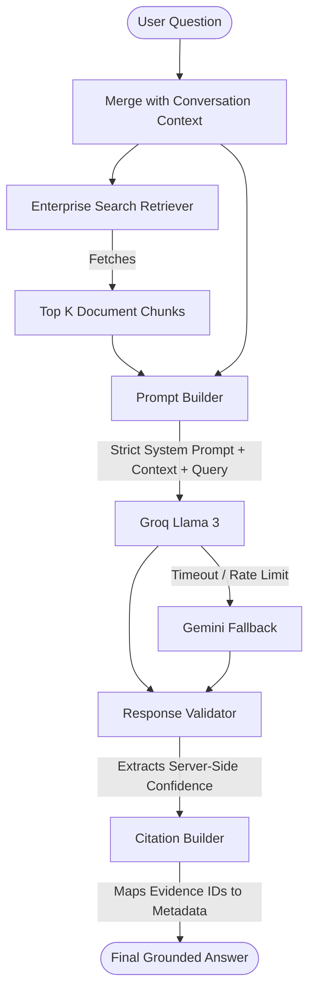

# Enterprise Retrieval-Augmented Generation (RAG)

The RAG pipeline is the core mechanism powering the AI Knowledge Assistant. It guarantees that the AI only answers using organizational facts, virtually eliminating hallucinations.

## RAG Flow

## Security & Grounding Strictures

1. **Context as Data**: The System Prompt explicitly instructs the LLM to treat the retrieved context as arbitrary data, preventing prompt injection attacks hidden inside uploaded documents.
2. **No Fabrication**: If the Retriever returns `0` results due to strict metadata filters or lack of knowledge, the pipeline short-circuits the LLM entirely and returns a hardcoded "Insufficient Evidence" response.
3. **Server-Side Confidence**: The LLM is not trusted to evaluate its own confidence. Confidence is calculated server-side based on the cosine distance and reranking scores of the retrieved chunks.
4. **Deterministic Citations**: The LLM outputs inline tags (e.g., `[1]`). The Server maps these tags back to the original SQLite/Qdrant metadata, ensuring the client receives exact `[Document ID, Page Number, Section]` citations.
