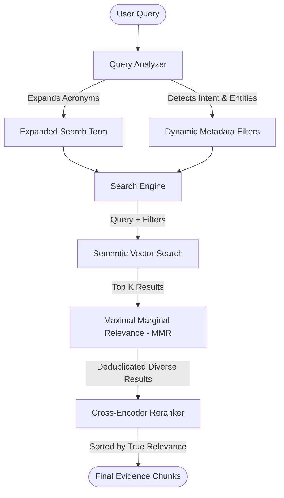

# Enterprise Search

The Enterprise Search module provides highly accurate, metadata-aware semantic retrieval across the organization's Knowledge Base.

## Retrieval Pipeline

## Core Mechanisms

### Query Analysis
Industrial queries often contain acronyms or specific part numbers. The Query Analyzer expands these terms while extracting explicit metadata filters (e.g., extracting `location: Plant A` from the query "How to fix the valve in Plant A").

### Maximal Marginal Relevance (MMR)
Semantic search can often return 5 chunks from the exact same page of a document because they are highly similar to the query. MMR penalizes redundancy, forcing the retrieval algorithm to select chunks that are both highly relevant to the query **and** diverse from each other, ensuring the AI gets a broader context.

### Reranking
Initial dense vector search (Bi-Encoder) is fast but sometimes misses nuanced context. The Cross-Encoder Reranker takes the top 30 diverse results from MMR and deeply scores them against the query, pushing the absolute best 5 chunks to the top for injection into the LLM context window.
