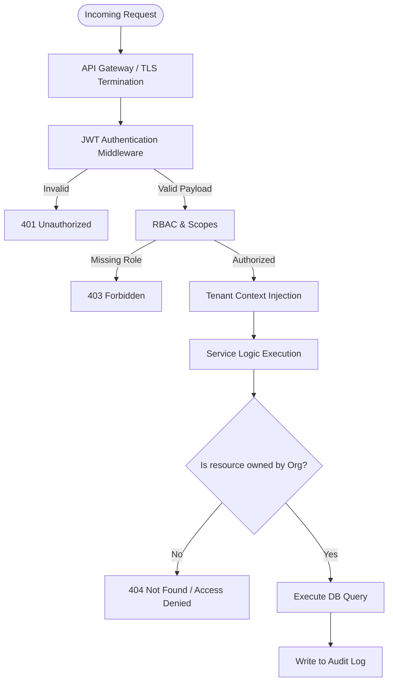

# Security Architecture

Security in RATAN is enforced across multiple layers, ensuring deep tenant isolation, explicit role validation, and comprehensive auditability.

## Security Layers

## Core Tenets

1. **JWT (JSON Web Tokens)**: Cryptographically signed tokens establish identity without persistent session lookups, maintaining stateless, high-performance horizontal scaling. Refresh tokens are tracked in `user_sessions` and can be forcibly revoked by administrators.
2. **Role-Based Access Control (RBAC)**: Fine-grained permissions are assigned to roles, which are assigned to users. FastAPI Dependency Injection (`Depends(RequireRole(["Admin"]))`) ensures endpoints are secure by default.
3. **Tenant Isolation**: The `get_tenant_context` dependency implicitly injects the user's `organization_id`. Every single `WHERE` clause in the Repository layer enforces this boundary, making cross-tenant data leakage practically impossible.
4. **Prompt Injection Protection**: The LLM System Prompt instructs the model to treat all user input and retrieved chunks as malicious, unexecutable data. 
5. **Audit Logging**: Every mutating action (Upload, Delete, Config Change) triggers an asynchronous write to the `audit_logs` table, attaching the exact IP, endpoint, user, and execution latency.
