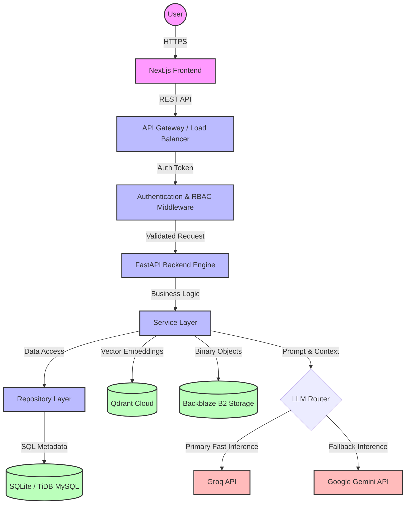

# High-Level System Architecture

The RATAN ecosystem is designed as a modular, API-first architecture, separating the client interface from core business logic, metadata storage, vector retrieval, and AI orchestration.

## Architecture Diagram

## Component Breakdown

1. **Next.js Frontend**: The presentation layer utilizing TailwindCSS for dynamic, responsive UI. Handles client-side state and communicates purely via REST.
2. **FastAPI Backend**: The core engine. Handles asynchronous routing, request validation via Pydantic, and strictly enforces tenant boundaries.
3. **Service Layer**: Contains isolated business logic (e.g., `DocumentService`, `RAGService`, `AdminService`), ensuring routers remain thin.
4. **Repository Layer**: Abstracts raw SQL queries into Python methods, ensuring the Service Layer is decoupled from the specific database dialect.
5. **Relational Metadata (SQLite / TiDB)**: Stores relational structures: Tenants, Users, Document states, audit logs, and Chat session histories. Uses SQLite for local dev and TiDB MySQL for highly-available production.
6. **Backblaze B2**: Immutable object storage containing the original physical PDF/Text files uploaded by users.
7. **Qdrant Cloud**: A highly scalable vector database holding embedded text chunks. Allows for semantic similarity searches filtered by tenant metadata.
8. **Groq (Primary LLM)**: Selected for ultra-low latency token generation, critical for conversational RAG flows.
9. **Gemini (Fallback LLM)**: Engaged via the Compensating Transaction Pattern if the primary provider experiences rate limits or downtime.
